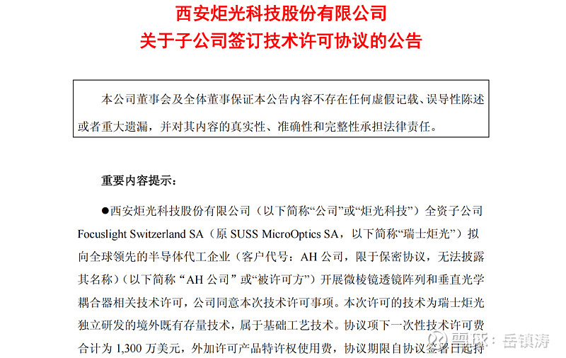
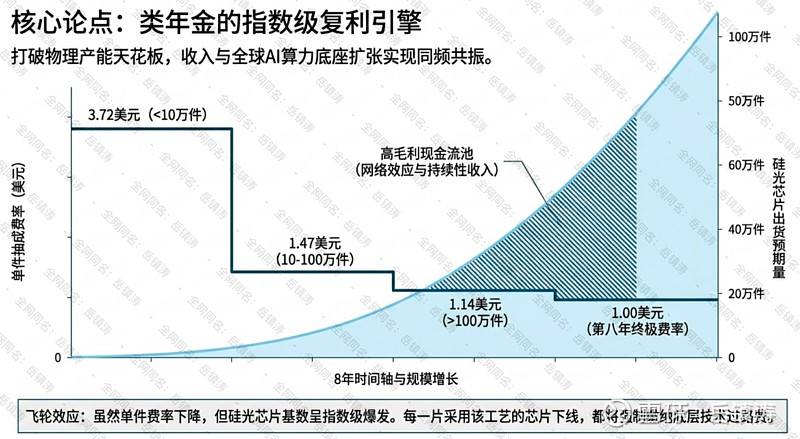
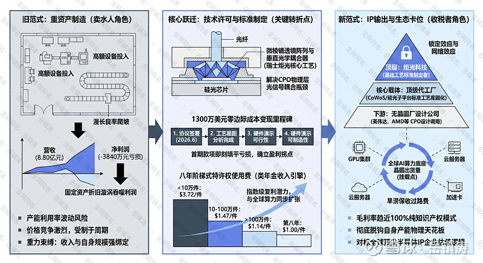
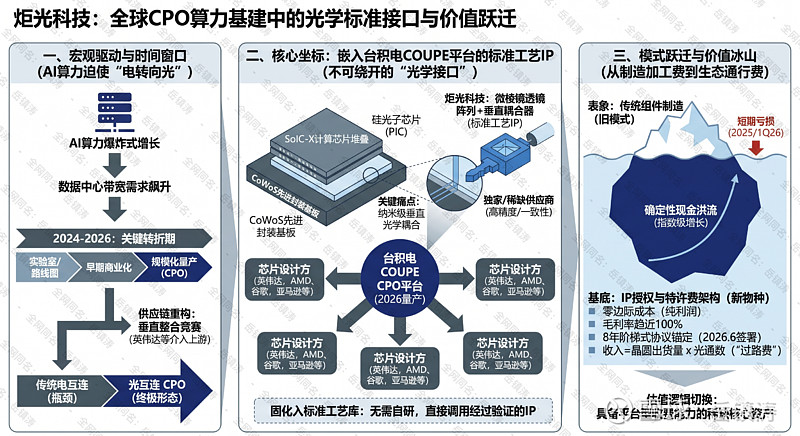
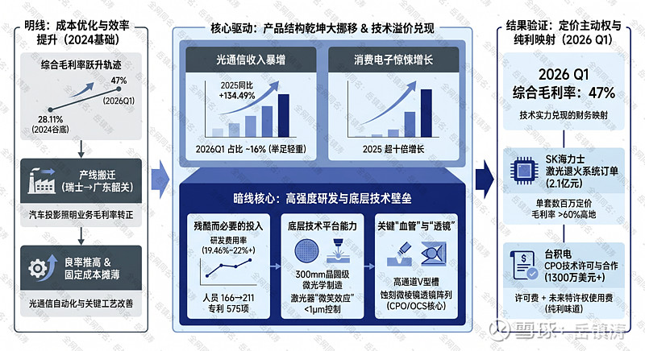
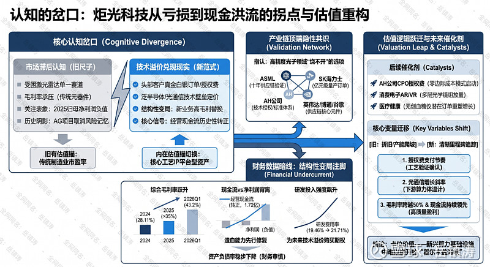

# 【岳深度】炬光科技：耦合轻重之变，微棱镜里见乾坤

来源：雪球App，作者： 岳镇涛，（https://xueqiu.com/8001988472/394855879）

提示：文中和文末可查看分析逻辑图。

一、从事件催化开始：从“卖水人”到“收税者”

我们的故事，从6月10日炬光公告中的技术许可协议开始：6月10晚间，炬光科技发布公告称，其全资子公司瑞士炬光（Focuslight Switzerland SA）与一家全球领先的半导体代工企业（代号“AH公司”，业内普遍推测其为台积电的可能性最高，但最终名单仍需以公司后续披露为准）达成技术许可协议，涉及微棱镜透镜阵列和垂直光学耦合器两项核心基础工艺技术的授权使用，金额1300万美元。

理解炬光科技的技术壁垒，不能孤立地看它生产了什么镜片或激光器，而必须将其置于一个更宏大、更残酷的产业竞赛背景下审视。这场竞赛的核心，是数据中心算力架构正在经历一场静默但剧烈的物理层革命，传统的电信号互联在高带宽需求下已濒临极限，光信号必须前所未有地贴近计算核心，这便是共封装光学，也就是CPO技术浪潮的本质。而在这场浪潮中，光信号如何高效、精准地从硅光芯片耦合进光纤，成了一个卡住所有人脖子的工程难题，这个难题的学名，叫做垂直光学耦合——炬光科技，或者说其全资子公司瑞士炬光所掌握的微棱镜透镜阵列与垂直光学耦合器基础工艺，恰恰是解开这道难题的少数几把钥匙之一。

这里的技术壁垒，首先不是实验室里的论文指标，而是实打实的、能够满足半导体晶圆代工厂严苛量产标准的工程化能力。全球范围内，能够提供满足这种精度、一致性以及苛刻公差范围要求的晶圆级微纳光学制造工艺的供应商，处于一种严重的真空状态。这便构成了第一重也是最直观的壁垒：制造工艺的稀缺性。当英伟达的GPU集群和博通的交换芯片渴望着更高带宽、更低功耗的光互联时，台积电这样的制造霸主必须为其硅光子平台寻找可靠的光学耦合方案，它没有时间去培育一个新手，市场上也几乎没有更成熟的备选，于是只能向既有技术的持有者——瑞士炬光——伸出合作之手。这份价值1300万美元外加八年销售抽成的技术许可协议，本身就是对其技术壁垒最权威、最市侩的定价。

然而，真正的壁垒远不止于精密的加工技艺。更深层次的跃迁，发生在商业模式与产业链地位的彻底重构上。过去的炬光科技，乃至绝大多数中国光学企业，扮演的是典型的卖水人角色。在算力淘金的热潮里，它们购置昂贵的设备，投入漫长的良率爬坡，消耗原材料和人力，生产出一片片光学镜片，赚取的是辛勤的加工费和渠道差价。这种模式的重资产属性极强，固定资产折旧如同高悬的达摩克利斯之剑，一旦产能利用率波动，利润便瞬间被吞噬，这恰恰是其在2025年财报上呈现亏损的本质逻辑。卖水人的命运，总是与淘金者的景气周期紧密绑定，且永远承受着价格竞争与产能过剩的压力。

而此次的授权协议，标志着一场静默的转变。炬光科技正在尝试从河边的卖水人，转变为河道关卡的收税者。这其中的技术壁垒，进化成了标准制定权的壁垒。协议授权的内容，并非一个具体的产品，而是一套基础工艺技术。一旦这套工艺被台积电消化、吸收并固化进其CoWoS先进封装或下一代硅光子平台的标准工艺库中，事情的性质就变了。未来，任何一家无晶圆厂设计公司，无论是英伟达、AMD还是其他玩家，当其设计基于该平台的CPO光模块时，都将不可避免地调用这套内含炬光技术基因的工艺。这时，炬光科技的收入便与自身的厂房面积、机器数量脱钩了，而是优雅地挂载在了全球顶级代工厂的晶圆出货量之上。每一片采用该工艺的硅光芯片下线，都可能为它带来一笔特许权使用费。这不是一次性的横财，而是一种具备网络效应和锁定效应的、类年金的持续性收入。它的技术，通过台积电这个最大的产业杠杆，渗入了未来AI算力底座的底层架构。这种从提供产品到输出标准、从赚取加工费到抽取技术税的跃迁，才是其技术壁垒最具想象力的部分，也使得它在A股一众光模块与元器件公司中显得如此异类，其商业模式的稀缺性，开始让人联想到那些靠知识产权架构统治移动世界的巨头。

二、新商业模式：零边际成本IP授权的降维打击

理解炬光科技此刻的商业价值，得抛弃对其传统制造业身份的认知锚定。那份与全球顶级代工厂签署的技术许可协议，其意义远不止于一笔价值1300万美元外加八年销售抽成的合同。它是一道清晰的战略分界线，标志着公司的盈利核心已经从一个需要巨额资本开支和漫长良率爬坡的重资产模型，跃迁至一个毛利率无限拔高的纯知识产权输出模式。这是一种从物理世界到数字世界的降维打击，其威力首先体现在对旧有盈利逻辑的彻底解构与颠覆。

过去，炬光科技的生意是典型的重资产制造。其利润表与庞大的厂房、精密的设备、波动的原材料价格以及产线上工人的熟练度深度绑定。这种模式的脆弱性在2025年的财务报表中体现出来。尽管营业收入增长了41%，达到8.80亿元，但归属于母公司所有者的净利润却录得3840.96万元的亏损。根源就在于，当产能利用率因市场波动而不足时，巨额的固定资产折旧如同一个深不见底的漩涡，瞬间就能吞噬掉所有表面上的营收增长，这是制造业与生俱来的重力。而2026年6月10日签署的这份协议，正是挣脱这股重力的开始。

它带来的转变是根本性的。首先，这是一次教科书式的零边际成本变现。协议许可的标的，是瑞士炬光独立研发并已在境外完成技术沉淀的既有存量基础工艺技术——微棱镜透镜阵列和垂直光学耦合器相关制造工艺。对公司而言，这笔交易无需新增一分钱的研发投入，无需扩建一平方米的厂房，无需采购任何新的物料。那1300万美元的总许可费，一旦按照四个里程碑（合同签署、工艺差距分析完成、在许可方硬件上演示可行性、在被许可方硬件上演示可制造性）分期落袋，其性质几乎是纯粹的利润，毛利率趋近于极限。首期400万美元的入账，按照当前汇率折算的近2880万元人民币，其威力足以瞬间填平公司2026年一季度的账面亏损，并向市场发出盈利拐点已至的明确信号。

但这仅仅是序曲。协议中更具战略价值的部分，在于那为期八年的阶梯式产品特许权使用费。这才是将商业模式从“一次性横财”升维至“持续性收税”的关键设计。根据协议，被许可方——那个被业内猜测是某全球代工巨头的AH公司，未来八年内，每销售一件采用该工艺的产品，都需要向炬光科技支付一笔费用。费率随累计销量阶梯式下降，从最初的每件3.72美元（销量低于10万件），到1.47美元（10万至100万件），再到1.14美元（超过100万件），并在第八年降至每件1美元。

这一条款的精妙之处在于，它彻底打破了炬光科技自身产能的物理天花板。公司的收入增长引擎，不再受限于自身工厂的规模、设备的数量和员工的排班。它被直接、牢固地挂载在了全球最顶尖半导体代工厂的晶圆出货量之上。未来，每一片采用该耦合工艺的硅光芯片从台积电的生产线上流出，无论最终被封装进英伟达的GPU、AMD的加速卡还是任何云巨头的服务器，炬光科技都能从中坐收一笔“过路费”。这是一种指数级的复利模式，其增长曲线将与全球AI算力底座的扩张同步，甚至可能更快。公司的角色，由此从一个在红海中搏杀、价格高度透明的“卖水人”，悄然转变为一个掌握底层通道、旱涝保收的“收税者”。这种商业模式的稀缺性，在整个A股光通信板块中凤毛麟角，其估值逻辑已然具备了对标全球顶尖半导体IP企业，如ARM公司的潜质。

这种降维打击的最终完成，体现在市场定位的根本性重塑上。技术授权，尤其是向AH公司这样的生态制高点的授权，其本质是炬光科技的工艺标准拿到了进入全球最顶尖AI硅光算力生态的绝对通行证。在半导体领域，一项工艺一旦被固化进台积电的CoWoS先进封装或下一代硅光子平台的标准工艺库，它就变成了下游所有无晶圆厂设计公司在进行芯片设计时无法绕开的“空气与水”。英伟达、AMD们的工程师在设计下一代CPO光模块时，将不可避免地直接调用这个带有炬光技术基因的工艺模块。届时，炬光科技将不再是与无数竞争者比拼成本与交付期的普通供应商，而是悄然站在了算力产业链的最上游，成为了定义底层架构的规则制定者之一。这才是零边际成本IP授权带来的终极降维打击——它不仅改变了公司的赚钱方式，更重新定义了公司在全球产业金字塔中的坐标。

三、全球CPO产业链中的稀缺坐标

此刻，当我们把视线从公司个体的财务模型与工艺细节中暂时抽离，拉升至整个数据中心光互连技术演进的全景时，会发现一个更为清晰的定位正在浮现。炬光科技，或者更确切地说，其瑞士子公司的核心工艺资产，正被历史的进程推向一个独特且日益坚固的坐标。这个坐标的价值，不仅在于技术本身，更在于它在全球算力基建从“电”转向“光”这一宏大叙事中，所扮演的那个无法被绕开、也极难被替代的标准化接口角色。它不是锦上添花的优化项，而是决定光能否被高效“导入”硅基芯片的物理现实。

理解这一坐标，首先要看清它所嵌入的战场格局。2024至2026年，正是全球CPO技术从实验室演示与路线图规划，迈向早期商业化与规模化量产的关键转折期。驱动这场变革的根本力量，是AI算力需求的爆炸式增长，它直接迫使数据中心内部的数据传输带宽需求飙升。英伟达CEO黄仁勋对介入产业链的重复强调，以及其在2026年密集投资Lumentum、Coherent等上游激光器供应商、并与康宁锁定光纤产能的行动，已经清晰地揭示：这场竞赛的胜负手，早已不局限于最终的GPU或交换机产品，而是延伸至对整个光互连供应链的垂直整合与控制能力。

在这场供应链重构中，技术路线的收敛与生态的站队同时发生。硅光子技术，因其与成熟CMOS工艺的兼容性，已成为高速光互联毋庸置疑的核心方案。而CPO，作为将光引擎与计算芯片一体化封装的终极形态，则是解决AI万卡集群功耗与带宽瓶颈的一个公认方向。于是，一个以台积电COUPE平台为中心的生态系统加速形成。这个由台积电自主研发的紧凑型通用光子引擎，旨在通过SoIC-X芯片堆叠与混合键合技术，实现电子芯片与光子芯片的高密度垂直集成。其路线图明确：2026年，COUPE平台进入量产，并以CPO形式集成到台积电的CoWoS先进封装中。

这便触及了问题的核心。一个宏伟的CPO架构蓝图，最终需要落到纳米级的工程实现上。其中最关键的工程瓶颈之一，便是在封装体内，如何将来自硅光芯片的光信号，以极低的损耗、极高的对准精度，垂直耦合进那根细如发丝的光纤。这正是炬光科技“微棱镜透镜阵列+垂直光学耦合”工艺所精准锚定的痛点。全球能够满足此类半导体级加工精度、一致性及苛刻公差要求的供应商极为稀缺。因此，当台积电在构建其COUPE平台的标准工艺库时，纳入炬光的方案，便从一个技术选项，演变为保障其平台性能与量产可行性的战略性需求。

于是，炬光科技的坐标变得清晰起来：它成为了台积电这座“算力晶圆厂”在迈向“光电共封”时代时，其标准工艺工具箱里的一个关键标准件。这个位置极具战略纵深。它意味着，未来任何希望采用台积电COUOS-S/硅光子平台来生产CPO芯片的设计公司——无论是英伟达、AMD，还是亚马逊、谷歌的定制芯片团队——在绘制芯片版图、调用标准工艺库时，都将不可避免地触及到这个“垂直光学耦合”的选项。他们无需再自行研发或四处寻找替代方案，这个功能已经作为一种经过验证的、可靠的IP，被固化在了代工厂的流程里。

这种“嵌入标准”的模式，赋予了炬光一种罕见的生态位优势。它不再是与数百家光模块厂商在产能、成本和渠道上肉搏的“组件供应商”，而是晋升为少数几家能为全球代工龙头提供底层工艺IP的“架构级伙伴”。我们可以从历史中找到几个有趣的对照：在芯片设计领域，ARM公司通过其指令集架构授权，渗透进了全球绝大多数移动设备；在制造领域，ASML凭借极紫外光刻机的绝对垄断，卡住了先进制程的咽喉。炬光在此刻CPO产业链中的角色，虽规模与领域不同，但其商业逻辑的内核有相似之处——它提供的是构建更大系统所必需且难以绕过的底层“门槛”或“工具”。

其稀缺性因此是多维度的。首先是技术供给的绝对稀缺，全球能稳定提供该级别晶圆级微纳光学工艺的玩家屈指可数。其次是生态卡位的先发稀缺，在CPO标准尚未统一的混沌初期，通过被台积电采纳，它已将自己的技术路线写入了最有可能成为主流的事实标准之中。最后是商业模式的协同稀缺，其零边际成本的IP授权模式，与台积电按晶圆出货量收费的代工模式完美契合，两者共同分享由AI算力增长带来的价值膨胀，而非在制造成本上相互挤压。

当然，这个坐标并非没有挑战与变数。CPO的发展仍面临散热设计、可靠验证、行业标准统一等多重挑战，且短期内与LPO、NPO等其他互连方案将共存竞争。英伟达在推动其Spectrum-X平台，博通则力推其Tomahawk系列CPO交换机并构建Open CPO联盟，不同的生态体系之间存在博弈。然而，无论最终哪个品牌或哪家系统厂商的CPO产品胜出，只要它们选择依托台积电的硅光子制造与封装平台来实现，那么，隐藏在台积电工艺库深处的那个光学耦合IP，其价值流就会持续涌动。

因此，当我们审视全球CPO产业链地图时，炬光科技不再是一个孤立的光学器件公司。它更像是一个悄然嵌入全球算力基建最底层、连接硅光芯片与光纤世界的微型但极其精密的“光学接口标准”。它的坐标，是由顶级代工厂的制造蓝图、AI巨头的算力需求以及自身历经沉淀的纳米级工艺共同测绘而成的。在这个坐标上，它收取的已不是简单的加工费，而是通往下一代数据中心架构的“通行费”。这份收入的持续性，将直接与全球硅光晶圆的出货片数，以及每一片晶圆上集成的光通道数量，形成牢固的正相关。这，便是其稀缺性的终极注脚。

四、财务数据的暗线：增长背后藏着什么？

47%，2026年第一季度财报上赫然印着的综合毛利率，你很难不注意到它。如果倒退回仅仅两年前，2024年那会儿，这个数字还蜷缩在28.11%的谷底，这仅仅是因为成本控制吗？当然不是。成本优化是那条最显眼、最容易被归因的明线。然而，如果故事仅止于此，那么炬光科技与任何一家通过精益生产改善盈利的经典制造工厂类公司并无二致。47%的毛利率，尤其在仍处于高额战略投入期的当下，其真正的基石埋藏得更深，那是产品结构的乾坤大挪移：

2025年，光通信市场收入同比暴增134.49%，消费电子市场收入更是上演了超过十倍的惊悚增长。到了2026年第一季度，光通信收入已经占到公司总营收的约16%，一个从无到有、再到举足轻重的比例。于是我们触及了暗线的核心：技术溢价。

毛利率的跃升，本质上是一场技术实力的兑现。高强度的研发投入，那19.46%甚至一度超过22%的研发费用率，在此刻显现出它残酷而必要的一面，研发人员从166人增至211人，已授权的575项专利构筑起知识的壁垒。你可以想象这样一个场景：在光通信领域，当客户为下一代CPO共封装光学或OCS光路交换机寻找核心光学部件时，他们需要的不是通用商品，而是能达到特定光学性能、满足严苛可靠性要求的“唯一解”或“最优解”。

炬光科技手里握着什么？是能将激光器微笑(Smile)效应控制在1微米以内的底层技术，是能在300毫米晶圆上批量制造微光学元件的平台能力。这让他们能够生产出高通道数的V型槽、蚀刻微棱镜透镜阵列这些光互联里的关键“血管”与“透镜”。当你的技术路线能覆盖从玻璃透镜到硅透镜的双重路径，当你的工艺能将微光学元件从“手工打磨”推进到“晶圆级流片”，你便拥有了定价的主动权。这种溢价，在SK海力士那份价值2.1亿元的激光退火系统订单里得到验证，单套价格高达数百万，毛利率据信站在60%以上的高地；更在AH公司那份协议里彰显到极致——1300万美元的CPO技术许可费加上未来的特许权使用费，这几乎是纯利的味道。技术，在这里直接翻译成了毛利率表上跳动的数字。

五、认知的岔口：从亏损到现金洪流的拐点

一边是台积电、SK海力士用真金白银的订单与授权费，为炬光科技在泛半导体与光通信领域构筑的技术壁垒进行定价；另一边，部分历史筹码似乎还在为那个曾经受困于激光雷达单一赛道、毛利率承压的传统元器件供应商画像。一边是技术溢价正在加速兑现的现实，另一边是认知调整滞后的惯性。理解这道岔口，是看清炬光科技未来走向的关键。

一部分悲观者的认知滤镜，似乎还停留在上一张财报的底色里。一个最直观的矛盾点在于毛利率的陡峭爬升与市场定价的温和反应。2024年，公司综合毛利率仅为28.11%，彼时资本市场将其归类于竞争激烈的传统激光器件板块，估值受到压制，这有其合理性。但故事从2025年开始急转，全年毛利率跃升至35%以上，并在2026年第一季度一举达到43.2%。驱动这近15个百分点跃升的，并非行业周期性的涨价，而是深刻的结构性变局：光通信业务收入在2025年同比增长134.49%，2026年一季度同比再增218%，收入占比快速提升至16%；消费电子业务更是上演了超过十倍的增幅。这些新兴业务的毛利率水平，显著高于公司传统业务。

当公司正在被高毛利的新血快速替换时，潜藏的历史筹码往往没有新资金那样激进的风格，他们仍部分沿用着看待“激光器制造厂”的旧尺子。另一个认知滞后的锚点，是激光雷达业务曾带来的阴影。尽管与欧洲Tier1客户AG相关的项目已全部取消，其在2025年的收入贡献仅占公司总营收的0.83%，风险基本出清，但这段记忆仍然像一个幽灵，拖累了市场对公司技术平台跨领域复用能力的整体评价——人们容易记住一次挫折，却低估了同一项微光学技术，在从汽车投影转向AR/VR光学、从激光雷达转向光通信耦合器时所爆发出的惊人延展力。

财务数据的暗线，正在为弥合这道认知裂缝提供最扎实的注脚。市场或许只看到了2025年归母净利润仍为负值（-0.38亿元）的表象，却可能忽略了更具先行意义的经营现金流在当年历史性地由负转正，达到1.72亿元。这表明公司的造血能力修复，已经跑在了会计利润扭亏的前面。研发投入的强度则揭示了这种溢价能力的来源并非偶然。2025年，公司研发费用飙升至1.71亿元，同比增长80.09%，研发费用率高达19.46%；2026年第一季度，这一比率进一步升至21.71%。如此决绝地将营收的近五分之一投向未来，投向光通信的CPO组件（V型槽、微棱镜等）、消费电子的晶圆级光学、泛半导体的激光退火——这种投入强度本身，就是在为未来的技术溢价购买期权，也是在向市场宣告其转型光子平台型公司的决心，绝非虚言。与此同时，资产负债率从2024年的28.27%稳步降至2026年一季度的25.39%，展现出与高研发投入并存的财务审慎。

客户名单，尤其是那些具备行业定义权的巨头们，正在形成一种“隐性共识”，持续消解着市场的疑虑。这不再是与一两家客户的偶发合作，而是一个系统性的背书网络：ASML用长达十年的供应链关系验证其光学制造的极致可靠性；SK海力士用亿元级订单为它的激光退火技术签发量产通行证；AH公司用技术授权将其纳入先进封装的光学标准体系；英伟达、博通、谷歌的供应链中，也能找到其光通信核心元件的身影。这些全球产业灯塔的选择，构成了一道坚实的认知防火墙——它们共同指认，炬光科技在特定的高精度光子领域，可能已经成为那个“绕不开”的选项。这种来自产业链顶端的共识，其力量终将缓慢而坚定地向资本市场渗透。

其后续的催化剂或许就藏在已经萌芽的业务线条里。AH公司CPO技术授权协议后的零边际成本收入（特许权使用费）模式，一旦随着CPO放量而启动，将彻底改变公司的盈利模型。消费电子领域，为北美头部客户AR/VR设备提供的多层光学镜组已完成多轮样品交付，只待终端产品掀起浪潮。而医疗健康业务，比如尚未确定的无创血糖仪光学核心元件潜在订单，则是一个足以重塑增长曲线的巨大变量。当这些“未来时”的业务，陆续转化为财务报表上的“现在进行时”，当市场逐一确认，激光雷达的挫折只是一个插曲而非主旋律时，当前的认知滞后便将让位于价值重估。届时，市场终将认识到，它面对的不仅是一家毛利率持续改善的公司，更是一个在AI算力、先进制造、智能交互等多重时代浪潮交汇处，掌握了核心“节点”技术的平台型选手。

故而，我们评估其前景的核心变量发生了根本性迁移。从盯着折旧费用和产能爬坡，转向追踪几个清晰可验证的里程碑。首先是那1300万美元授权费剩余三期的支付节奏，每一次工艺验证的成功、每一笔数百万美元的到账，都是对技术壁垒有效性和商业前景确定性的即时确认。其次是光通信业务本身那令人瞠目的增长斜率，一季度218%的同比增速并非昙花一现，它是下游算力饥渴症最直接的体温计，预示着制造环节也能在高景气赛道中快速修复利润，与IP授权业务形成现金流上的“双轮驱动”。最后，也是最具想象力的，是观察其综合毛利率能否快速跨越50%这一战略分水岭，以及经营性现金流净额持续大幅领先于净利润的黄金背离能否延续，这是高质量盈利模式最扎实的脚注。

放在更广阔的估值坐标系里看，炬光科技正在完成一场惊险的跃迁。它从一家可能被归类为“光学器件制造”的公司，悄然蜕变为一家拥有核心半导体工艺IP的、具备平台型收费能力的稀缺资产。当悲观者还在用传统制造业的市盈率审视其旧有的失败和亏损时，它内在的估值锚已然切换。A股光通信板块中，能够向台积电这样的生态顶端玩家逆向输出标准、并持续收取特许权使用费的企业，凤毛麟角。

这种商业模式的质变，估值逻辑更应贴近那些拥有深厚专利墙和平台型生态的科技企业，使其成为在新兴算力基础设施中，那难以绕开的、霍尔木兹海峡般的卡位环节。

$炬光科技(SH688167)$ #光通信# #CPO概念持续火爆# #炬光科技#
