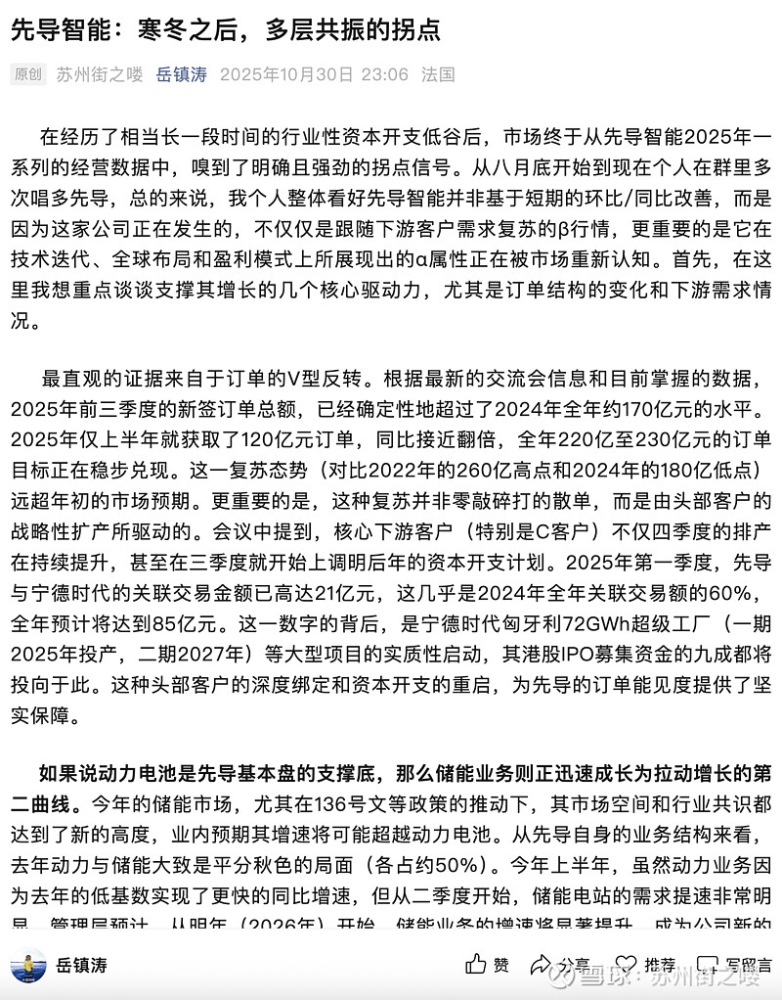

# 为何从八月底起便看好先导智能？

> 来源：雪球 - 岳镇涛专栏
> 原文链接：https://xueqiu.com/8001988472/372908250
> 日期：2026-01-25

---

重温这篇我于10月撰写的推文，中长线账户在40、50低谷一路加仓格局至今，坚信价值的力量，耐心即是美德。

正文如下：

在经历了相当长一段时间的行业性资本开支低谷后，市场终于从$先导智能(SZ300450)$ 2025年一系列的经营数据中，嗅到了明确且强劲的拐点信号。从八月底开始到现在个人在群里多次唱多先导，总的来说，我个人整体看好先导智能并非基于短期的环比/同比改善，而是因为这家公司正在发生的，不仅仅是跟随下游客户需求复苏的β行情，更重要的是它在技术迭代、全球布局和盈利模式上所展现出的α属性正在被市场重新认知。首先，在这里我想重点谈谈支撑其增长的几个核心驱动力，尤其是订单结构的变化和下游需求情况。

最直观的证据来自于订单的V型反转。根据最新的交流会信息和目前掌握的数据，2025年前三季度的新签订单总额，已经确定性地超过了2024年全年约170亿元的水平。2025年仅上半年就获取了120亿元订单，同比接近翻倍，全年220亿至230亿元的订单目标正在稳步兑现。这一复苏态势（对比2022年的260亿高点和2024年的180亿低点）远超年初的市场预期。更重要的是，这种复苏并非零敲碎打的散单，而是由头部客户的战略性扩产所驱动的。会议中提到，核心下游客户（特别是C客户）不仅四季度的排产在持续提升，甚至在三季度就开始上调明后年的资本开支计划。2025年第一季度，先导与宁德时代的关联交易金额已高达21亿元，这几乎是2024年全年关联交易额的60%，全年预计将达到85亿元。这一数字的背后，是宁德时代匈牙利72GWh超级工厂（一期2025年投产，二期2027年）等大型项目的实质性启动，其港股IPO募集资金的九成都将投向于此。这种头部客户的深度绑定和资本开支的重启，为先导的订单能见度提供了坚实保障。

如果说动力电池是先导基本盘的支撑底，那么储能业务则正迅速成长为拉动增长的第二曲线。今年的储能市场，尤其在136号文等政策的推动下，其市场空间和行业共识都达到了新的高度，业内预期其增速将可能超越动力电池。从先导自身的业务结构来看，去年动力与储能大致是平分秋色的局面（各占约50%）。今年上半年，虽然动力业务因为去年的低基数实现了更快的同比增速，但从二季度开始，储能电站的需求提速非常明显。管理层预计，从明年（2026年）开始，储能业务的增速将显著提升，成为公司新的核心增长点。这一判断同样有宏观数据的支撑：2025年上半年，仅国内储能电池出货量就高达265GWh，同比激增128%。先导并非被动受益，而是主动布局，其开发的全自动储能集装箱产线自动化率高达90%，并已成功承接了如宝丰集团20GWh这样的大型订单，这证明了其技术方案在匹配大容量、高效率储能需求上的领先性。

在全球化布局和订单质量方面，先导智能也展现出了超越同行的韧性和高增长潜力。今年前三季度的新签订单结构中，海外订单占比已达30%（国内锂电占50%，3C消费电子占15%）。对于市场普遍担忧的出口管制政策，近期交流的反馈清晰：这并非禁止行为，只是需要申请许可，且申请时间相比设备制造和验收周期来说很短，对业务的实质性影响较小。事实上，公司前三季度的海外收入依旧保持着同比正增长，且毛利率进一步提升至40.27%的健康水平。这背后有两大支撑：一是公司遍布全球的18个海外分子公司和欧洲物流中心（可支撑45天交付）所构建的本土化服务能力；二是海外订单本身的含金量更高，其单GWh的设备价值量普遍在1.3亿至3亿元人民币，远高于国内约1亿元/GWh的水平。我们看到，无论是大众、宝马、Reliance这样的纯海外客户，还是跟随宁德时代匈牙利工厂、新华达泰国项目出海的国内客户，都在为先导贡献高质量的海外增量。这不仅优化了公司的收入结构，更重要的是，高毛利率的海外订单将成为其整体盈利能力修复的关键一环。

但如果仅仅停留在“行业回暖、订单回来了”，那就远远低估了这家公司正在发生的质变。在我看来，比订单数量反转更具决定性意义的，是其在下一代技术上的领先卡位，以及由此带来的盈利能力的结构性修复。这正是我看好其价值的核心所在。

最大的亮点，无疑是固态电池。先导智能目前是全球范围内唯一一家能够提供全固态电池前中后道整线设备服务能力的企业。这不只是一句宣传口号或者说公司领导层画的大饼，而是实实在在的技术壁垒和先发优势。目前，公司的产品不仅已经成功出货给QuantumScape这样的海外标杆企业（据传双方签有200亿元框架协议），同时也向国内头部客户（如C客户）提供了设备进行测试验证，并且已经收到了重复订单。这是其技术方案可行性有力的背书。从订单数据看，今年上半年固态电池订单约4-5亿元，其中海外占比超过一半，有一家客户甚至订购了整线设备。而管理层明确预计，下半年随着国内头部客户在固态领域投入的加快（已在积极推进中试线级别的招标），下半年的固态订单将环比上半年表现更好。

我们可以清晰地认识到这个时间节点的意义。业内将2027年视为全固态电池商业化量产的元年，这意味着2025年到2026年，正是各大电池厂从实验室走向中试线、再到小规模量产线的关键窗口期。先导智能在这个阶段凭借其整线能力和在干法电极、等静压（公司目前重点布局且已验证的方案）等核心工艺上的深度积累，几乎锁定了早期研发和中试线的较大部分份额。这些订单不仅价值量高，其毛利率水平（分析普遍指向45-50%）也远非当前成熟的液态锂电设备（约30-35%）所能比拟。这不仅是未来的增长点，更是其毛利率天花板得以突破的关键。

顺便一提，谈到毛利率，就不得不说说公司三季度的财务表现。三季度核算的毛利率偏低，这确实是一个让市场和本人担忧的点。但经过深入了解，我发现这恰恰是利空出清的信号。三季度的低毛利，主要是因为集中确认了在去年行业低谷期签订、并因客户原因拖延验收的低毛利订单，这些订单的成本在拖延中被动提高，导致了报表上比较难看。但这在较大的比例上是一个滞后指标。交流后得到的四季度及未来的展望是清晰的：毛利率将恢复并持续提升。这个信心的来源，正是我们前文分析的订单结构的变化——高毛利率的海外订单（前三季度毛利率已达40.27%）占比在提升，更高毛利率的固态电池订单开始进入确认周期，同时国内常规订单的毛利率也随着行业秩序恢复而趋于正常。

与毛利率修复相伴的，是净利润端一个容易被忽视的巨大弹性来源——信用减值损失的冲回。在2023至2024年的行业下行周期中，公司出于审慎原则，累计计提了高达28亿元的巨额减值准备，这在当时极大地拖累了净利润。而现在，随着行业回暖、客户现金流改善以及公司自身强力的回款管理，这些应收账款正在被收回。财报显示，2025年前三季度，公司已经冲回了约4.3亿元的信用减值损失（如Q2单季冲回1.3亿）。结合近期交流的结果来看，大规模计提的阶段已经结束，后续将以冲回为主。这意味着，在未来几个季度，减值冲回将成为公司净利润的加速器，其带来的利润增厚效应，将使得净利润的修复速度显著快于营收和毛利率的爬坡速度。

最后，再说说先导在非锂电业务上的布局。在前三季度的新签订单中，3C消费电子业务占比达到15%，保持了良好的增长和毛利率提升。而在光伏领域，公司也展现了高度的战略定力，并没有在行业低谷期盲目扩张，而是战略性地选择聚焦于BC电池等新技术方向，持续获取订单，并且现金流回款正常。这种在非核心业务上的审慎和聚焦，反过来也保障了公司能集中优势资源，在锂电和固态电池的主赛道上全力冲刺。

对先导智能的整体看好建立在一个多层次的逻辑链条之上：短期看，订单V型反转和下游（动力+储能）需求的确定性复苏，为其提供了坚实的业绩底座；中期看，海外高毛利订单占比的持续提升和历史减值包袱的大幅出清，正在驱动其盈利能力进入快速修复的上升通道；而长期看，其在全球固态电池设备领域的唯一性整线布局，已经构筑了极高的技术壁垒，这将在未来3-5年的技术迭代中，为其带来可观的超额收益和估值弹性。

若有错误、不同观点或补充，欢迎交流

---

【风险提示】本公众号所有内容均不构成任何投资建议，仅是个人记录中选择网络公开部分的内容节选，用于分享研究思路和心得，不具有任何指导作用，其中所包含的观点、建议并未考虑个体阅读者在财务状况、投资目的、风险偏好等方面的具体情况，个体阅读者应当独立评估其中所含信息，基于自身投资目标、需求、市场机会、风险及其他因素自主做出决策并自行承担投资风险。文章中所提股票均只用于举例、关注和便于分析思考用，并非投资建议或构成任何形式的暗示，请勿跟票！
