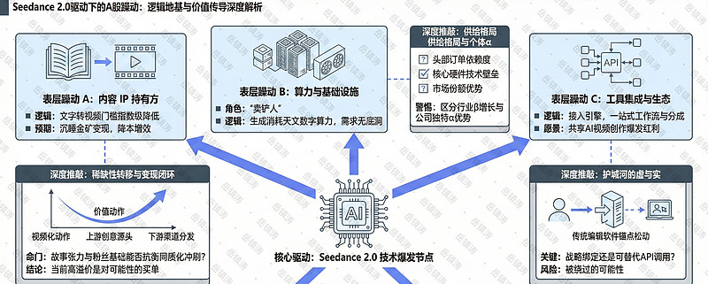
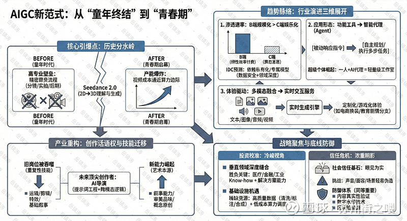
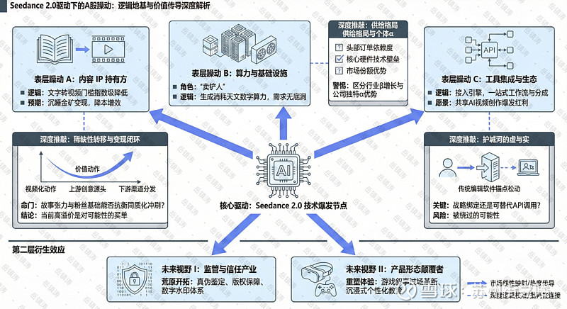

# Seedance 2.0题材深度分析：AIGC的童年时代结束了吗？

> 来源：雪球 - 岳镇涛专栏
> 原文链接：https://xueqiu.com/8001988472/375679768
> 日期：2026-02-10

---

#Seedance概念大涨，荣信文化涨停# #春节假期临近，持股过节VS持币过节？#

提示：文末可查看研究逻辑总结图。

冯骥那句“AIGC的童年时代结束了”，究竟意味着什么？是蹒跚学步的终结，还是意味着一个更莽撞、更不可控的青春期的开始？当我们目睹Seedance 2.0仅凭一张楼宇正面照，便能“理解”并生成其背面的三维结构与街景时，一种寒意与兴奋交织的战栗，恐怕才是从业者最真实的体感。这远非一次简单的技术迭代，它更像一道分水岭，将内容生产的历史粗暴地切成两段：之前，与之后。

之前的世界，成本与创意是一对永恒的冤家。影视工业那套精密而昂贵的流程——分镜、实拍、后期——构筑了极高的专业壁垒。之后呢？冯骥预言的“产能爆炸”正扑面而来，一般性视频的制作成本开始无限逼近算力的边际成本。这意味着什么？意味着视频作为一种表达方式，其经济门槛正在土崩瓦解。一切曾因成本考量而止步于图文或简单幻灯的展示，无论是电商广告、产品预演，还是教学课件，都将轻易地、洪水般地向视频形态迁移。视频全民化，不再是一个愿景，而是一个正在发生的、略显嘈杂的现实。

但这股洪流，最先冲刷和重塑的，必然是影视工业的河床。那位学习了七年数字电影制作的网友的恐惧，并非杞人忧天。当运镜、剪辑、特效、乃至初步的叙事节奏都能由模型“自发”(或半自发)地完成时，传统组织结构中大量基于重复性技能和执行的岗位，其存在价值将被迫接受最严厉的拷问。然而，这绝非创作的终结。恰恰相反，工具的民主化将竞争的核心，从“能否实现”猛烈地推向“实现什么”。叙事的能力、审美的品味、概念的原创性，这些更接近艺术本源的元素，其价值会被前所未有地放大。未来的顶尖创作者，或许是一位深谙如何与AI协作的“导演”，他的核心技能不再是操作复杂的软件，而是精准的提示词工程、审美把控和跨模态的叙事逻辑。工具在吞噬旧岗位的同时，也在催生新的话语权。

那么，站在这个童年结束、青春启幕的节点，未来的浪潮将涌向何方？行业的趋势，已然显现出几条清晰的脉络。

首先，是B端（企业服务）的规模化渗透将远远快于C端（消费者）的娱乐化应用。这看似反直觉，实则逻辑坚硬。C端用户为娱乐付费的意愿是飘忽的，而B端企业为效率付费的意愿则是刚性的。Seedance 2.0所展示的能力，在营销广告、产品演示、员工培训、客户服务等场景中，能直接转化为可量化的成本削减与效率提升。IDC的预测也佐证了这一点，未来企业将更多依赖私有化、专属化的模型，以满足对数据安全与领域深度的双重需求。因此，第一波成熟的商业模式和投资回报，很可能并非来自我们日常刷到的短视频，而是藏在企业内部的流程优化与创意中台里。

其次，应用形态将从“功能工具”演变为“智能代理”。这意味着，AI不再是被动响应指令的绘图员或剪辑师，而是能够自主规划、执行多步骤任务的协作者。例如，一个AI智能体能根据一份新品简报，自动完成从市场调研、脚本生成、视频制作到多渠道分发的全流程。这带来的变革是颠覆性的：它让超级个体成为可能。一个人，配以成熟的AI代理，便能运作一个轻量级的创意工作室或营销公司。组织的形态，因而开始松动、重构。

再者，多模态融合将成为标配，并驱动体验的游戏化与实时化。Seedance 2.0已经展示了文本、图像、音频、视频的联动生成能力。下一步，正如冯骥所联想，视频将不再是一段封闭的、预先渲染的片段，而可能向定制化、可交互演进，成为某种“全新的娱乐方式”。想象一下，在电商直播中，你不仅能切换主播的服装背景，还能实时生成符合你提问的专属讲解片段；在教育场景中，历史人物可以根据你的选择，演绎不同的剧情分支。这模糊了视频、游戏与即时服务的边界，开辟出全新的体验赛道。

趋势既明，投资的指针又该如何校准？喧嚣之中，更需要冷峻的视角。

首要的关注点，或许不该再是追逐通用大模型的参数竞赛，而是垂直领域与场景的深度缝合。当基础能力如Seedance 2.0已然具备“地表最强”的潜质时，决胜的关键就在于谁更懂医疗影像的细微特征、谁更能理解金融合规文本的复杂逻辑、谁更能生成符合工业标准的零部件设计图。那些在特定行业拥有深厚数据积累、领域知识（Know-how）和渠道能力的团队，能将大模型的能力转化为切实解决痛点的解决方案，他们构筑的壁垒，远比单纯的技术指标更为坚固。

其次，是围绕高质量数据与算力优化的基础设施。这是一个略显枯燥但至关重要的领域。模型的“聪明”程度，最终取决于“喂养”它的数据质量。然而，全球高质量的训练数据面临枯竭的预警早已响起。因此，在数据清洗、标注、合成，以及隐私计算确保合规的前提下进行数据价值挖掘的技术与服务，将成为稀缺资源。同样，如何以更低的成本、更高的能效比来调度和提供算力，让Seedance 2.0这样的模型能力能够普惠至中小企业，这里蕴藏着巨大的基础设施机会。

然而，在所有的乐观展望背面，我们必须直面Tim所警示的那片浓重阴影：信任的危机。技术狂奔中，责任底线是最后的刹车片。Seedance 2.0迅速限制真人面部上传的举措，是一次必要的“克制”。但当生成逼真视频变得毫无门槛，当声音、面容乃至记忆中的场景都能被轻易伪造时，我们社会赖以运行的信任基石——眼见为实——将被动摇。这不仅仅是技术问题，更是法律、伦理和社会治理的综合性挑战。投资于内容真实性验证、数字水印、基于区块链的溯源技术，或许与生成技术本身同等重要。未来的平台价值，不仅在于它能创造什么，更在于它能否可信地区分真实与虚构。

回到最初的问题：AIGC的童年结束了吗？我想，是的。那个需要向公众费力解释“AI是什么”的懵懂时期过去了。但结束的，只是一个阶段。我们迎来的，是一个技术能力开始指数级溢出、与社会伦理和传统产业发生剧烈碰撞的“大变革前夜”。它不像童年那般单纯，充满了青春期特有的力量、迷茫与风险。但市场总是这样，当一项技术以足够戏剧性的方式刺破天际，资本的探照灯便会瞬间聚焦，将一切沾边的名字映照得金光灿灿。Seedance 2.0引发的这场A股躁动，无非是这古老剧本的又一次上演。影视传媒板块应声大面积涨停，中文在线、掌阅科技、荣信文化……这些名字在行情软件上连成一片灼目的红色。热闹是真实的，但热闹之下的逻辑地基是否同样坚实？我们不妨将目光从闪烁的报价屏上移开，投向那些被资金洪流裹挟的个体，看看它们究竟站在浪潮的哪个位置。

首先浮现在视野里的，是那些手握海量IP的内容持有者，比如掌阅科技和中文在线。它们的逻辑最为直接，也最容易被市场情绪放大：有了Seedance 2.0这般犀利的工具，将小说、漫画IP转化为视频内容的成本和门槛将指数级降低，一座沉睡的金矿似乎触手可及。这逻辑有错吗？表面上无懈可击。但致命的疏漏，恰恰在这里。工具能解决生产效率，却无法凭空创造需求，更无法保证产出的内容具备打动人心的叙事灵魂。当所有人都能轻易将文字变成视频，内容的稀缺性不会存在于“视频化”这个动作本身，而会迅速转移到更上游的创意源头和更下游的渠道分发。这意味着什么？意味着这些公司估值的重估，绝不能仅仅建立在“我有IP，我能AI化”的简单等式上。核心命门在于，你的IP库是否具备足够强的故事张力和粉丝基础，来承受住可能到来的、海量同质化AI视频的冲刷？以及，你是否已经构建了属于自己的、稳固的内容分发与变现闭环？若抽去这两根支柱，所谓降本增效带来的利润空间，很可能被市场竞争瞬间摊薄。实话说，市场此刻给予的高溢价，更多是在为一种可能性买单，而非为一份确定性背书。

与内容方的弹性想象相比，另一条线索则显得沉默而坚硬——算力与基础设施。润泽科技、浪潮信息、中科曙光等，它们是这场盛宴中“卖铲人”的角色。逻辑同样清晰：Seedance 2.0每一次惊艳的生成，背后都是天文数字的算力消耗。模型越强大，应用越普及，对底层算力硬件的需求就越像无底洞。这条逻辑链的确定性，似乎远高于内容变现的故事。但这就够了吗？恐怕未必。当我们谈论算力受益时，必须穿透需求增长这个表象，去审视供给的格局和公司自身的卡位。字节跳动的算力订单，是否构成了某家公司决定性的收入来源？该公司在服务器、芯片、数据中心或光模块的竞争版图中，是否拥有难以替代的技术壁垒或份额优势？否则，所谓的受益可能只是行业性的β增长，而非公司独特的α。这就很有意思了，资本的狂热有时会模糊这两者的界限，将板块性的暖风误解为个体命运的东风。

还有一些公司，站在生态的交叉点上，比如万兴科技。它们被炒作的逻辑可能是产品集成与按调用量分成。这描绘了一幅美好的图景：作为创意软件工具，它接入最强大的AI视频引擎，为创作者提供一站式工作流，然后随着AI视频创作的爆发而共享增长。愿景很丰满。但我们需要一点冷静的推敲：这种集成关系的排他性与深度究竟如何？是战略级的生态绑定，还是可被替代的API调用？更重要的是，当Seedance 2.0这类模型的能力如此强大且界面愈发友好时，传统视频编辑软件的价值锚点是否正在松动？用户是为了使用万兴喵影的剪辑功能，还是为了其集成的Seedance通道？如果答案是后者，那么公司的护城河，是在加深，还是在被悄然绕过？

纷繁的标的列表背后，其实涌动着一场深刻的认知博弈。市场的第一反应，是沿着“内容-算力-工具”的产业链进行线性映射。这没错，这是教科书式的解读。但技术革命的涟漪从来不会止步于教科书。冯骥所言的“AIGC童年结束”，暗示了一个更复杂的成年世界正在开启。当视频生成变得如此廉价和逼真，真正的投资机会可能不会停留在“谁能用它”的层面，而会向两端迁移：一端是监管与信任产业，即如何鉴定真伪、保障版权、建立数字水印体系——这是一片尚待开拓的荒原；另一端，则是那些能够利用这项技术，重新定义产品形态、创造全新交互体验的颠覆者。例如，游戏科学会不会用它来革新叙事过场动画的产能？教育公司会不会借此打造高度个性化的沉浸式课程？这些第二层、第三层的衍生效应，目前还在资本的视野之外沉沉睡着。

所以，如何看待这些标的？我的看法或许有些固执。在技术爆发的早期，尤其是像Seedance 2.0这样兼具突破性与争议性的节点，资本市场的映射往往是剧烈而失真的——它用涨停板来表达兴奋，用概念归类来简化复杂。作为观察者，我们需要的不是追逐那份已然炽热的名单，而是去理解名单上每一个名字，其内在价值与外部催化之间，那根细细的、颤动的连接线是否足够强韧：

有些线，是坚固的钢缆，连接着确定的业绩增长；有些线，则是精美的丝线，承载着美好的故事，却也易断。当热浪退去，潮水会将前者托举得更高，而后者，或许需要经历一番估值与现实的残酷校准。这过程，本身就和AI生成视频一样，充满了随机的噪声与必然的规律。而我们能做的，或许就是在喧嚣中，努力分辨那规律的低语。

$润泽科技(SZ300442)$ $掌阅科技(SH603533)$ $中文在线(SZ300364)$
