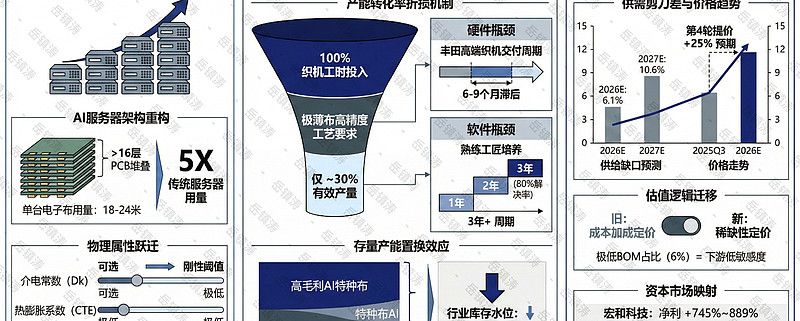
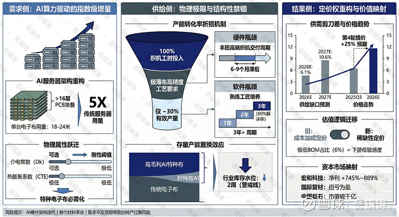
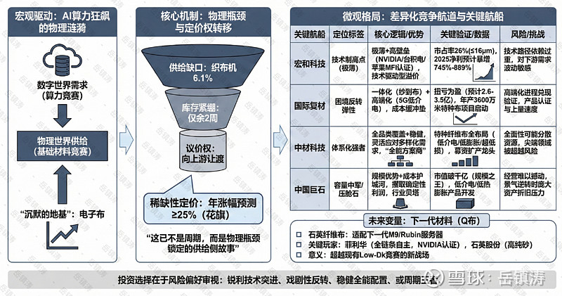

# 电子布涨价题材深度分析：格局分化后的宏和科技、国际复材、中国巨石们

> 来源：雪球 - 岳镇涛专栏
> 原文链接：https://xueqiu.com/8001988472/376163065
> 日期：2026-02-13

---

提示：文末可查看分析逻辑总结图。

自2025年下半年起，高端电子布的缺货状态已持续近一年，行情非但没有缓解，反而在2026年开年愈演愈烈。2月4日，光远新材、国际复材等龙头企业再度发出提价通知，这已是自2025年以来的第四轮提价，幅度大、周期短。价格曲线陡峭上扬的背后，是一场静默的、关于物理极限与产业定价权力的深刻嬗变。

驱动力的故事，起点清晰得近乎直白：AI算力需求的指数级增长。但这并非泛泛而谈的需求回暖。英伟达GB300服务器将PCB层数推高至16层以上，单台电子布用量激增至18至24米，这是传统服务器的五倍。更关键的是质变。AI服务器对信号传输速率和稳定性的苛刻要求，迫使覆铜板必须向高频高速升级，其核心增强材料——电子布，也必须具备更低的介电常数和热膨胀系数。于是，Low-Dk、Low-CTE等特种电子布从可选品变成了必需品，从性能的修饰词变成了设计的先决条件。需求的故事，因此分化为两层：一层是AI带来的总量倍增，另一层是AI驱动的结构升级。后者，才是定价逻辑变轨的起点，也是所有喧嚣的根源。

然而，供给端的响应却异常迟钝，甚至可以说是被多重锁链禁锢。市场起初将目光聚焦于织布机，这没错，但只对了一半。日本丰田的高端织布机交付周期长达6-9个月，无疑是刚性瓶颈。但更深层的锁链在于工艺本身：生产越薄、性能越高的特种布，对织机张力和精度的要求呈几何级数上升，单台设备的产出效率会骤降——生产极薄布时，理论产量可能仅为厚布的30%左右。这意味着，即便织机数量不变，当产能纷纷转向高毛利的AI特种布时，普通电子布的有效供给会被被动且巨量地吞噬。这就是当前传统布紧缺与AI布景气是一体两面说法的物理基础。企业主动的产能转产，如台耀科技宣布停产部分传统布，更是加剧了这一收缩。结果便是，传统电子布头部企业的库存被压缩到仅有两周，远低于1-1.5个月的正常水平。库存，这个周期行业的缓冲垫，几乎消失了。

这就触及到一个反直觉的真相：本轮涨价的根源，或许不在于“生产不出来”，而在于“生产什么”以及“如何生产”的结构性扭曲。织布机是硬件瓶颈，但熟练产业工人的短缺，是同样顽固的软件瓶颈。培养一名能熟练处理复杂工艺异常的挡车工，需要三年以上，而三年也仅能解决百分之八十的问题。在追求快节奏扩张的资本面前，这种属于工匠的时间尺度，构成了另一种无声的抵抗。因此，当我们看到1080布价格翻倍、小厂加价1.8倍仍一货难求时，所反映的已是整个产业体系在超负荷下的紧绷状态，一种由技术、设备和人力共同编织的稀缺性。

那么，价格的天空在哪里？机构的预测指向了持续的上行空间。花旗分析师认为2026年涨价幅度可能达到25%甚至更高。支撑这一判断的，是对供需缺口持续性的测算。国内也有头部机构研究表示，2026-2027年织布机环节的供给缺口可能分别达到6.1%和10.6%。即便在最乐观的假设下，行业也只能维持紧平衡。更为深远的影响在于定价逻辑的迁移：从成本加成，转向稀缺性定价。由于电子布在PCB总成本中占比仅约6%，且高端产品供应高度集中，下游客户对涨价的敏感度被大幅削弱，上游材料厂商的议价能力正在历史性地增强。这不再是简单的周期波动，而是一次产业链利润分配的重新谈判。

当然，投资的世界总是急于寻找映射。股价的涨停潮是预期的即时贴现。中国巨石市值突破千亿，国际复材、宏和科技业绩扭亏或数倍增长，都是这轮景气度在财务报表上的初啼。宏和科技预计2025年净利润同比增长745%到889%，国际复材则实现扭亏为盈。但我们需要一点冷思考。这场景气能持续多久？共识指向2026年是兑现年份，而产能的实质性缓解或许要等到2027年底。这里隐藏着一个关键的灰域：一旦AI硬件架构发生迭代，或出现革命性的替代材料，当前基于物理性能稀缺性的估值逻辑是否会松动？这是悬挂在所有参与者头上的达摩克利斯之剑。另一个风险在于，当前的火热部分源于“转产效应”，若下游领域需求不及预期，这种结构性错配带来的涨价动能能否持续，也需要观察。

说到底，电子布的涨价叙事，是数字世界算力狂飙在物理世界激起的涟漪。它清晰地揭示，AI的竞赛不仅是算法和芯片的竞赛，更是基础材料、精密制造和产业工人体系的竞赛。当我们仰望由算力构成的数字大厦时，它的地基，正由这些沉默的布匹一针一线地编织。价格的波动，不过是这座地基承压时发出的、最易被听见的声响。而真正的故事，关于极限、关于替代、关于重构，才刚刚翻开序章。对于投资者而言，理解这层逻辑，或许比追逐下一个涨停板更为重要。

当我们谈论电子布行业的未来，2026年已不再是一个预测年份，而是一个正在展开的现实。机构测算中那6.1%的织布机供给缺口，并非冰冷的数字，它意味着价格传导的阻力极小，意味着下游的议价权正在历史性地向上游让渡。稀缺性定价，这个在经济学课本里充满理想色彩的概念，正成为这个行业每日交易的真实准则。花旗预测的25%甚至更高的年度涨幅或许即将快速应验——在库存仅余两周的紧绷状态下，任何一点需求的火星，都可能引爆新一轮的跳涨。这已不是周期，而是一场由物理瓶颈锁定的、至少贯穿未来十八个月的供给侧故事。然而，前景的明朗，绝不意味着所有参与者都能等比例地分享荣光。浪潮固然托起所有航船，但每艘船的龙骨强度、航帆质地与船长心智，将决定其最终能抵达的彼岸。让我们将目光从宏大的海图，移向几艘关键的航船。

$宏和科技(SH603256)$，无疑是这片海域的技术制高点。它的标签极为清晰：极薄。厚度小于等于16微米的极薄布，全球市占率高达26%，这不仅是数字，更是穿透下游严苛认证体系的通行证。通过英伟达、台积电认证，成为苹果在中国大陆地区唯一的MFI认证供应商，这些背书构筑了几乎无法逾越的客户壁垒。它的故事，是典型的技术驱动型溢价。当行业因“转产效应”而普涨时，宏和享受的是结构性需求爆发与自身技术稀缺性的双击。其2025年净利润预计暴增745%至889%，正是这种双击效应的初步财务显影。但它的风险也藏于这份极致之中。技术路径的依赖过重，使其对下游顶级客户的需求波动极为敏感。若下一代芯片封装技术发生路线微调，对极薄布的需求可能瞬间变化。投资它，是在投资电子布领域最锋利的那把“手术刀”，锋利，却也需承受与之对应的脆弱。

视线转向$国际复材(SZ301526)$，我们看到的是另一番景象：困境反转的弹性之美。从亏损到预计盈利2.6至3.5亿元，其股价的强势早已超越了简单的扭亏叙事。它的核心逻辑在于“一体化”与“高端化”的共振。一方面，它拥有从玻纤纱到电子布的完整产业链，这在原材料成本波动时构成了天然的缓冲垫，甚至能形成内部成本优势。另一方面，它正奋力向高端跃进，自主研发的5G用低介电玻璃纤维已获应用，年产3600万米特种电子布项目也已启动。这意味着，它既能在普通电子布的涨价潮中夯实利润基底，又能在高端市场的盛宴中谋得一席。它的魅力在于增长的想象空间与相对合理的估值起点并存。然而，它的挑战也同样明确：高端化的进程能否如期兑现？面对宏和这样在高端领域已建立先发优势的对手，其产品的认证与上量速度，将是下一个关键观察点。

$中材科技(SZ002080)$ 则展现出一种“体系化”的强者姿态。它不追求单项极致，而是谋求全品类的覆盖与领先。从低介电一代、二代布，到低膨胀布，再到超低损耗布，它完成了特种纤维布全品类产品的布局与批量供货。这种能力，使其能够灵活应对下游客户多样化的需求，成为供应链中可靠的“全能方案商”。近期其通过定增募资投向特种玻纤布建设，目标直指全球AI特种玻纤布龙头，野心昭然。它的优势是稳健与全面，风险则在于这种全面性是否会分散资源，在某个需要单点爆破的尖端领域被更专注的对手超越。投资中材，是投资一个在电子布军备竞赛中，拥有最完整武器库和强大军工体系的军团。

而中国巨石，我们必须单独谈论。它已不仅仅是电子布航队中的一艘船，在某种程度上，它是这片海域的船中压舱之石（巧在公司名也有石字）。市值突破千亿，是全球玻纤无可争议的规模之王。它的逻辑是宏大而直接的：规模优势带来的成本护城河，使其在涨价周期中能攫取最丰厚、最确定的利润流。低介电、低热膨胀产品的开发，则是为其庞大的身躯注入面向未来的科技灵魂。投资巨石，某种意义上是在投资整个行业景气的贝塔，同时相信其管理层有能力将规模优势转化为持续的技术进化能力。它的风险或许最“小”，但也最“大”——小在经营层面难以撼动，大在一旦行业景气度逆转，其庞大的资产规模可能面临更大的折旧压力。

此外，我们还必须提及一个若隐若现的“未来变量”：石英纤维布（Q布）。这是适配下一代M9级别覆铜板、面向Rubin服务器等更未来的材料。菲利华作为国内唯一实现石英砂到布全链条自主的企业，已通过英伟达认证。石英股份则为Q布提供核心的高纯石英砂。这条技术路径尚未放量，但已指明了超越现有Low-Dk竞赛的下一片战场。它提醒我们，当前如火如荼的景气，只是材料迭代长河中的一段湍流。

行文至此，景象已然清晰。电子布的前景，是一条宽阔而明确的上涨航道。但航道之上，宏和凭技术尖刀博取超额溢价，国际复材靠反转与一体化演绎弹性故事，中材科技以全体系能力构筑稳健堡垒，中国巨石则以巨无霸体量坐享行业红利。它们各有各的罗盘，指向不同的利润海域与风险暗礁。对我们而言，选择哪一艘船，不在于简单地判断潮汐方向，而在于审视自己的航海图：你追求的是锐利的技术突进，是充满戏剧性的反转之旅，是稳健的全能配置，还是毋庸置疑的周期王者？答案，就在你对自身风险偏好的诚实审视之中。浪潮终会退去，那时，只有龙骨最坚韧、航位最精准的船只，才能留在下一段航程的起点。

