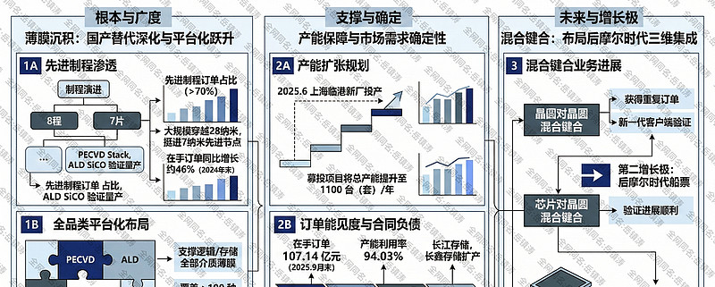
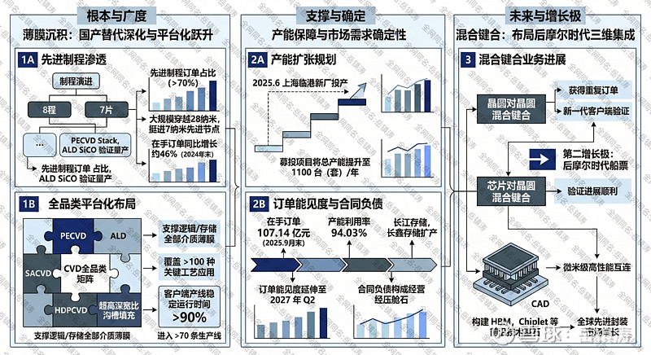
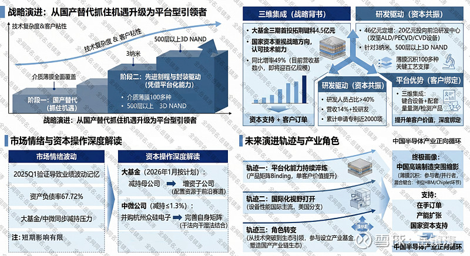

# 拓荆科技：开棘拓荆，静待花开——薄膜沉积与混合键合的创新、攀登与进取

> 来源：雪球 - 岳镇涛专栏
> 原文链接：https://xueqiu.com/8001988472/377143135
> 日期：2026-02-27

---

市场近期对拓荆科技的讨论，似乎陷入了一种短暂的迷茫。一面是股价在二月上旬略显疲态的波动和二月下旬突如其来的上涨；另一面，则是公司订单簿上日益沉重的分量，以及技术路线上清晰可闻的突破声响。这种背离，往往不是逻辑的失效，而是认知的时滞。我们不妨将视线从日线图、分时图的涟漪上移开，投向决定一家高端制造企业命运的更深层要素：工艺的渗透深度，与赛道的卡位精度。拓荆科技在这两方面的进展，或许正在悄然重塑其价值的基础。

谈论拓荆科技，薄膜沉积是一个无法绕开的起点，也是其安身立命的根本。但今天理解它的意义，不能停留在国产替代这个略显笼统的标签上。关键不在于替代本身，而在于替代到了什么层次，以及这种替代的节奏是否在自我加速。根据公司2025年指引的信息，一个细微但至关重要的变化正在发生：基于新型设备平台和反应腔的PECVD Stack、ALD SiCO等先进制程验证机台，已顺利通过客户认证，进入了规模化量产阶段。更值得玩味的是，有分析指出，其先进制程订单占比已超过百分之七十。这意味着什么？意味着公司的主力产品，正在大规模穿越28纳米乃至更成熟制程的舒适区，向芯片制造最前沿、价值量也最高的腹地挺进。客户愿意在7纳米这样的先进节点上批量采用其设备，这本身就是对技术可靠性和工艺成熟度的最高投票。它解答了一个根本性质疑：国产设备是否只能徘徊在技术边缘？拓荆科技用订单结构给出了答案。这个进程，与下游逻辑芯片向更先进制程演进、存储芯片向更高堆叠层数发展的产业趋势是同频共振的。市场或许还在用旧的制程地图来衡量它，而它的产品早已在新大陆登陆。

薄膜沉积业务的韧性，有一组数字可以提供近乎物理性的支撑。截至2025年9月末，公司在手订单金额高达107.14亿元，现有产能利用率已达94.03%。为了消化这些汹涌而至的需求，公司的产能扩张计划具体而激进。上海临港新厂已于2025年6月投产，而根据其对定增问询函的回复，通过本次募投项目，公司总产能将提升至1100台（套）每年。产能规划从来不是闭门造车，它必须与下游的扩产节奏严丝合缝。长江存储、长鑫存储等国内大厂的扩产计划，正是这台机器轰鸣的源头活水。订单的能见度已经延伸至2027年第二季度，这几乎为未来两年的营收勾勒出了一条高度确定的轨迹。当我们在讨论成长股的波动风险时，往往忽略了，高达数十亿元的合同负债和近乎满负荷的排产，本身就是一块厚重的压舱石。短期的市场情绪犹如天气，而订单与产能构成的，是公司经营的地理气候。

拓荆科技的根基，在于它已悄然完成了从单一产品突破到平台化布局的蜕变。它的内核早已不只是一个国产替代的故事。在薄膜沉积这条主航道上，它从早期攻克PECVD设备实现从零到一的突破，如今已构建起覆盖PECVD、ALD、SACVD、HDPCVD及超高深宽比沟槽填充CVD的全品类矩阵。这意味着什么？意味着它能够支撑逻辑芯片与存储芯片制造中所需的全部介质薄膜材料，覆盖约一百多种关键工艺应用。这不再是点的替代，而是面的覆盖。公司的设备已进入超过七十条生产线，累计出货反应腔数量在2024年中就超过一千九百四十个，并且预计全年出货将创历史新高地超过一千个。订单的饱满程度是直接的印证，截至2024年末，其在手订单金额约九十四亿元，同比增长约百分之四十六。这些数字背后，是产品在客户端产线稳定运行时间超过百分之九十、达到国际同类水平的可靠表现。

更值得玩味的，是其面向未来的布局。半导体技术演进至后摩尔时代，三维集成成为突破物理极限的关键路径。拓荆科技前瞻性地切入了混合键合这一新兴领域。晶圆对晶圆键合设备、芯片对晶圆键合前表面预处理设备，这些名字或许艰涩，但它们正是构建HBM高带宽内存和Chiplet芯粒这些前沿技术的基石性设备。

如果薄膜沉积是拓荆科技当下坚实的地基，那么混合键合所代表的先进封装与三维集成设备，则是其精心构筑的第二增长极，这关乎公司能否抓住后摩尔时代的船票。摩尔定律的物理极限日益迫近，通过芯片堆叠提升性能、降低功耗的三维集成技术，已成为公认的突破路径。而混合键合，正是实现晶圆或芯片间微米级、高性能互连的核心工艺。拓荆科技通过控股子公司拓荆键科在此领域的前瞻布局，正从技术储备快步走向产业验证。令人鼓舞的信号已经出现：其晶圆对晶圆混合键合设备获得了重复订单，新一代产品已发往客户端验证；芯片对晶圆混合键合设备验证也进展顺利。重复订单，在设备领域是一个含金量极高的词汇，它意味着首台设备的工艺稳定性、产出良率得到了客户的认可，标志着从"能用"到"好用"的关键一跃。这块业务的想象空间，与AI催生的高带宽存储器HBM、Chiplet等产业浪潮紧密捆绑。全球先进封装市场的迅猛增长，为键合设备提供了广阔的舞台。

国家集成电路产业投资基金三期的动向，为这个赛道的价值做了另一重背书。2025年9月，大基金三期向拓荆键科增资4.5亿元。值得注意的是，这被市场视为大基金三期成立后的首次对外投资。这种"首投"的选择，绝非偶然，它清晰地传递了国家资本对三维集成这一战略方向的重视，以及对拓荆科技在该领域技术能力的认可。资本的支持，与客户的订单，从两个维度验证了同一条路径的正确性。当然，这项业务目前的营收基数尚小，但其高达百分之四十九的同比增长率，以及即将到来的百亿级市场规模预期，让我们有理由相信，它并非遥远的童话，而是渐行渐近的现实。当市场还在犹豫这是否只是一个概念时，订单和资本已经先行一步。

将视线拉回公司整体，我们会发现，拓荆科技正处在一个典型的资本开支与研发投入共振的周期。那份46亿元的定增计划，是一个观察窗口。其中，高达20亿元将投向前沿技术研发中心，重点攻坚先进ALD、PECVD及沟槽填充CVD设备。这绝非盲目的扩张，而是基于现有技术架构，对下一代技术制高点（如3纳米、500层以上3D NAND）的针对性投入。公司的研发人员占比超过百分之四十，这是一个以创新为血液的组织结构。持续的专利产出，则是这种投入的外在显化。在半导体设备这场马拉松里，一时的领先不足为恃，持续的研发投入所形成的专利壁垒和人才梯队，才是抵御国际巨头竞争、维持长期溢价的根本。

当我们把产能、技术、新兴赛道、资本意志这些碎片拼合起来，一幅更清晰的画像便浮现出来。拓荆科技早已不是单一产品的突破者，它正演进为一个平台型的解决方案提供商。在薄膜沉积领域，其产品已能支撑逻辑与存储芯片制造中约100多种关键工艺应用，实现了介质薄膜的全面覆盖。在三维集成领域，它提供的不仅是键合设备，还包括配套的量测与检测产品。这种平台化能力，极大地增强了客户粘性，降低了单一产品技术迭代的风险。公司持续将营收的14%以上投入研发，累计申请专利近两千项，这是在为下一场技术竞赛储备弹药。它的成长叙事，已经从"抓住国产替代的机遇"，升级为"凭借平台化能力，深度参与并驱动国内半导体产业的先进制程与先进封装升级"。

那么，回到最初的那个市场背离。为何在如此多积极边际变化下，股价仍会呈现波动？原因可能是多方面的。或许是部分投资者对2025年第一季度因新产品验证导致业绩波动的记忆犹新，担心历史重演；或许是高达67.72%的资产负债率让一些谨慎的投资者望而却步；又或许，大基金与产业资本（中微公司）的同步减持，在短期内构成了情绪面压力。但是，大基金在2026年1月按计划减持了拓荆科技母公司股份的同时，却早已将资金注入代表未来方向的混合键合子公司。这种"减持母公司，增资子公司"的资本操作，绝非简单的看空或看多，它更像是一次精密的资产结构再平衡，将资源更集中地配置于最具战略性的前沿赛道。解读股东行为，必须穿透表层动作，洞察其背后的产业布局逻辑。另外，中微公司公告减持拓荆科技不超过1.3%的股份，目的是"优化公司资产结构，盘活公司存量资产"，为其收购杭州众硅电子（一家CMP设备公司）的并购计划提供资金。这本质上是一家平台化设备公司为完善自身产品矩阵（从干法向干湿法结合迈进）而进行的财务安排。它与拓荆科技自身的技术竞争力关联甚微，更多反映的是产业资本在不同发展阶段下的资源配置选择,也可能是短期涨幅较大后的正常获利了结，将产业资本的财务性减持，简单等同于对同行技术前景的看淡，是一种危险的误读。市场的情绪波动，有时就源于这种粗糙的归因。这些情绪因素，在漫长的产业成长面前，其影响力往往是短暂的。投资的本质，有时是在与市场的时间偏好做斗争。当绝大多数注意力被眼前几日的涨跌吸引时，那些需要数月甚至数年才能完全绽放的产业趋势，便留下了认知的偏误。

展望前路，拓荆科技将驶向何方？我们或许可以勾勒出几条隐约的轨迹。其一，是平台化能力的持续淬炼。从薄膜沉积到先进键合，再到配套量测，公司提供的产品矩阵正日益成为一个有机的整体。这种平台化优势，能深度绑定客户，提升单客户价值，更能基于对工艺的深刻理解，孵化出下一代设备。其二，是国际化视野的悄然打开。尽管当前业务高度集中于国内，但任何顶尖的技术，其终极考场都应是全球市场。公司在美国设有分支机构，其设备性能已达国际主流水平，这为未来的潜在出海埋下了伏笔。其三，也是最具挑战的一点，是从技术突破到生态引领的角色转变。半导体设备从来不是孤立的机器，它需要与材料、设计、制造工艺紧密协同。拓荆科技参与设立产业基金，其深意或许正在于此——通过资本纽带，更深地融入并塑造国产半导体产业链的生态。

但归根结底，拓荆科技的故事，是中国高端制造突围的一个缩影。它不再是一个关于替代的悲情叙事，而是一个关于创新、关于攀登、关于在核心技术领域争得一席之地的进取篇章。在薄膜沉积主航道上，它正从国产替代的替代者，蜕变为先进制程的参与者甚至并行者；在混合键合的新航道上，它凭借先发优势和技术积累，已卡位HBM与Chiplet产业链的关键设备环节，从故事期迈入订单验证期。两者共同构筑了一个兼具深度与宽度的平台化设备企业画像。而这一切，又被饱满的在手订单、坚定的产能扩张和持续的国家资本支持所托底。它的未来，不仅取决于自身研发的锐度与管理的精度，更与中国整个半导体产业能否形成正向循环、能否培育出滋养顶尖技术的肥沃土壤休戚相关。我们关注它，是在关注一个样本，观察一家企业如何以技术为舟，在时代的洪流中，既顺流而下，又逆流而上，最终抵达那片属于创造者的广阔海域。穿过眼前的荆棘，市场的噪音终会消逝，而技术进步的刻度，将永远被铭记。

