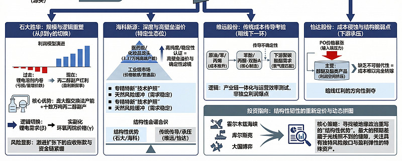
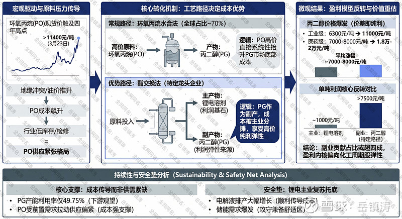
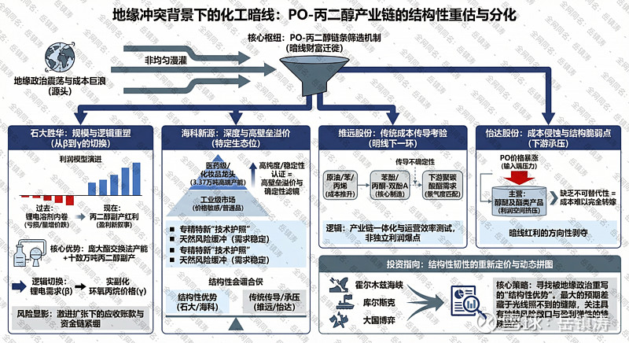

# 地缘冲突的明线与暗线：当副产物成为主引擎，化工的隐秘支流

> 来源：雪球 - 岳镇涛专栏
> 原文链接：https://xueqiu.com/8001988472/381681329
> 日期：2026-03-29

---

ps：4400字，文中和文末可查看分析逻辑图。

我们谈论化工行业的周期复苏，目光总习惯性地追逐那些宏大叙事——地缘冲突推高油价，化工涨价如火如荼。这当然没错，但利润的泉眼，有时恰恰藏在主叙事线的阴影之下，以一种近乎反直觉的方式喷涌。当下溶剂行业的图景便是如此：市场为锂电排产的复苏而欢呼，却可能忽略了，真正重塑企业盈利模型的，并非前台主角溶剂本身，而是一向被视为配角的副产丙二醇。这并非简单的涨价故事，而是一场由独特工艺路径所决定的、关于成本结构优势的故事。

表面上看，逻辑链条清晰得近乎单调。中东局势扰动推升原油，进而带动核心原料环氧丙烷价格飙升。截至今年3月23日，山东地区环氧丙烷现货价已突破每吨11400元，触及近四年高点。成本压力顺理成章地向下传导。然而，戏剧性就在这里展开。对于海科新源、石大胜华这类采用酯交换法生产锂电溶剂的企业而言，环氧丙烷的暴涨，非但不是利润的侵蚀者，反而成了利润的放大器。奥秘在于，它们的生产过程中会同步产出丙二醇。而全球市场上，大部分的丙二醇正是由环氧丙烷通过水合法制成的。这就意味着，当环氧丙烷价格因成本推动而高企时，整个丙二醇市场的价格底部被系统性抬升。采用酯交换法的企业，其丙二醇的成本大头已被主产品溶剂分摊，此刻面对的，是一个因成本推动而不断上移的售价。价差，几乎就是纯利，边际上的超额利润。

于是我们看到了一组令人瞩目的价格分叉。工业级丙二醇从三月初的每吨6300元涨至11000元，高端医药级产品更是从七八千元的区间飙升至一万八到两万元。这平均七八千元的涨幅，对于溶剂企业来说，其利润属性是纯粹的。有测算显示，头部企业丙二醇业务的单吨利润可能超过7500元。这个数字需要放在语境中理解——同期，作为主业的锂电溶剂，其单吨利润可能仅在千元左右徘徊。那么，谁才是真正的利润核心？答案已经悄然反转。据测算，丙二醇业务对海科新源和石大胜华的利润贡献占比，可能已经接近甚至超过四成。市场若仍沿用"锂电材料股"的估值框架去审视它们，便可能犯下方向性错误。它们此刻的盈利内核，更贴近于"化工周期股"，其弹性直接挂钩于环氧丙烷-丙二醇这条传统化工链条的价格传递。

那么，这种盈利模式的可持续性如何？会不会只是成本脉冲下的昙花一现？我们需要审视供需的底层。从供应看，一个微妙的数据是，当前丙二醇行业的产能利用率仅为五成左右，下游追高意愿偏弱，市场弥漫着观望情绪。这似乎与价格暴涨的景象矛盾，实则揭示了本轮行情的本质——它并非由丙二醇自身供需紧张驱动，而是纯粹的成本传导效应。只要环氧丙烷价格居高不下，丙二醇的价格就有支撑。而环氧丙烷的供应，目前看来并不宽松。年初以来，由于主力装置检修、行业开工率走低，库存已降至低位。同时，聚醚多元醇因出口退税政策取消而引发的订单前置，进一步拉动了环氧丙烷的需求。成本支撑与需求拉动形成了共振。因此，这条利润支流的持续性，短期内更取决于上游环氧丙烷的强势能否维持，而非丙二醇自身的产能过剩。当然，我们不能忽视主叙事带来的安全感。锂电需求的强劲复苏，为整个溶剂基本盘提供了坚实的托盘。电解液排产同比大幅增长，储能领域的需求爆发尤其显著，这确保了溶剂企业能够顺利地将原材料成本上涨部分转嫁给下游，甚至实现一定的超额利润。主业不拖后腿，副业贡献弹性，这种攻守兼备的态势，构成了企业难得的舒适区。

那么，这是否意味着所有溶剂企业都能平等受益？绝非如此。利润的分配高度依赖于技术路径。核心受益者，严格限定于采用酯交换法、且拥有显著丙二醇产能的龙头企业。这块话题中，海科新源与石大胜华之所以被反复提及，不仅在于其规模，更在于其工艺带来的天然成本优势。尤其是海科新源，作为国内医药级丙二醇的龙头，其产品能够攫取价格金字塔顶端的溢价。这种由工艺和资质构筑的壁垒，是其他后来者难以短期复制的。行业的利润，正在向这类具备全产业链视角和独特成本结构的公司集中。

进一步地，我们沿着那条隐秘的溪流继续前行，便会发现，水势虽大，河道却陡然收窄。地缘冲突掀起的成本巨浪，并非均匀地漫灌整片化工平原。它更像一场精确的溯源洪水，只充盈那些具备特定地质构造的河谷。明线上的喧嚣——油气的暴涨、航运的紧张、军工的躁动——固然惊心动魄，但暗线里的财富迁徙，其冷酷与精确，才真正决定哪些企业能安然度过周期，甚至逆流而上。此刻，PO-丙二醇链条的馈赠，正以其严苛的标准，对产业链上的玩家进行一场无声的筛选。

**石大胜华：**观察石大胜华，仿佛在观看一部微观的产业周期纪录片——从周期谷底的挣扎者，蜕变为暗线逻辑的教科书。就在数月前，它还是行业困境的缩影：产品价格下跌，净利润大幅下滑，陷入量增价跌的典型陷阱。其2025年前三季度的亏损，以及此前连续三年的利润下滑，清晰地刻画出行业产能过剩期的惨烈。甚至其2024年的生存，都极度依赖海外市场那不足三成营收却贡献超七成毛利的输血。国内业务，在报表上已近乎无利可图。这是一幅标准化工周期股在低谷的画像，黯淡，令人疲惫。

然而，地缘政治的闪电劈开了这潭死水。逻辑的转换有时快得让人晕眩。当市场还在消化其糟糕的季报时，股价已悄然启动。3月27日，石大胜华二连板，市盈率TTM虽为负值，但市净率已升至4.52，处于历史中高位。这绝非简单的超跌反弹。市场正在用真金白银，为一种全新的盈利叙事投票。旧的叙事是锂电溶剂龙头陷入内卷红海，新的叙事则是：一家拥有庞大酯交换法产能和十数万吨丙二醇副产的企业，其利润模型的核心变量，已从锂电需求的β，切换为环氧丙烷价格的γ。

它的命门，此刻系于中东的硝烟与港口的航运表。这很残酷，但这就是暗线资产的本质——其命运与远方的风暴紧密捆绑。它的优势同样鲜明：产能规模最大，产业链条最长，从溶剂、六氟磷酸锂到电解液，甚至前瞻布局硅基负极以对冲固态电池风险。这种复杂性在过去是负担，在当下却可能成为波动中的稳定器。当丙二醇的利润洪流涌入，它最先、也最能承接。但风险也随之显影：其激进的电解液扩张带来的应收账款暴增和资金链紧绷，在行业景气时或被掩盖，一旦潮水方向有变，便会成为致命的礁石。投资它，是在押注这场由地缘冲突催化的成本传导盛宴，其持续时间足以覆盖它自身财务结构的调整周期。押注对了，便是周期反转与估值重塑的双击；押注错了，则可能只是又一轮残酷的产能出清前夜。

**海科新源：**如果说石大胜华展现的是规模与产业链的广度，那么海科新源则揭示了暗线红利的另一种形态：深度与纯度。它的故事更聚焦，也更锋利。作为国内医药级丙二醇的龙头，其3.37万吨/年的高端产能满产，意味着它攫取的不是普通工业品的涨价，而是精细化工领域的高壁垒溢价。当丙二醇价格普涨时，高端品的涨幅往往更凌厉，从七八千元飙升至近两万元的区间，这其中的价差，蕴含着更高的利润纯度。

这就很有意思，我们面对的，其实是一个分层的市场。地缘冲突推高了所有丙二醇的成本底线，但最终的价格天花板，则由各自的应用领域决定。医药、化妆品领域的客户，对价格的敏感度远低于工业领域，他们为纯度、稳定性和认证支付溢价。海科新源卡住的，正是这样一个高价值的生态位。它的逻辑，因此比石大胜华少了一点产业链的广度、多了一层"确定性"的滤镜。即便未来某一天PO价格回落，工业级丙二醇价格随之坍塌，医药级产品因其稳定的需求和更高的准入壁垒，价格回落的速度和幅度都可能更缓。这给了它一层天然的风险缓冲。

因此，看待海科新源，不应仅仅将其视为丙二醇涨价的普通受益者。它更像是一个在特定细分领域拥有"技术护照"的专精特新企业，偶然间，它所在的这个小王国，因为一场远方的战争，而获得了意外的矿产发现。它的弹性或许不如石大胜华那般波澜壮阔，但它的利润质量与可持续性的预期，或许更为扎实。它的风险，则在于技术路径的依赖和单一产品线的集中度，以及市场是否愿意持续为这份"纯度"支付高昂的估值溢价。

当我们把目光移向维远股份和怡达股份，暗线的光谱发生了微妙的折射。它们同样身处相关产业链，但受益的逻辑已非直接与纯粹。

**维远股份：**维远股份的核心在于"苯酚/丙酮-双酚A-聚碳酸酯"产业链。地缘冲突推高原油，进而推升其核心原料苯、丙烯的价格，这是成本压力。它能否传导，取决于下游聚碳酸酯等产品的需求。这里没有副产丙二醇那样的意外之财，只有传统化工企业面对成本冲击时的传导能力考验。它的故事，更贴近于我们最初谈论的"明线"传导的下一环，更为传统，也更为艰辛。其投资逻辑，需要审视其产业链一体化程度与下游需求景气度的匹配，而非寻找一个独立的利润爆点。

**怡达股份：**怡达股份则提供了另一个视角。它是环氧丙烷的重要下游之一，主营醇醚及酯类产品。PO价格暴涨，对它而言是赤裸裸的成本侵蚀。除非它拥有某种不可替代性，能将成本完全转嫁，否则其利润空间会受到挤压。在这个链条里，它可能处于相对不利的位置。当然，如果它自身也拥有独特的工艺或副产品优势，逻辑又会不同，但这需要更细致的拆解。就主逻辑而言，它提醒我们，暗线红利具有强烈的方向性，它馈赠一些人，同时也在剥夺另一些人。

梳理至此，我们或许能触摸到一些更冰冷、也更真实的东西。地缘冲突下的投资，不是在追逐某个确凿的答案，而是在一系列脆弱的因果链中，下注于那些更具韧性的结构。

石大胜华和海科新源代表了一种结构韧性：其工艺路径（酯交换法）在特定的成本冲击下，转化为了利润结构优势。这优势是偶然的，也是必然的——源于其多年前的技术选择。维远股份代表了另一种韧性：产业链的纵向整合能力，考验其在成本风暴中的运营与传导效率。怡达股份则可能提示了结构的脆弱点。

那么，我们的思考应该导向何处？或许不是简单地比较谁的利润弹性更大。而是去问：哪家企业赖以生存的"结构性优势"，在这场由地缘政治重写的成本剧本中，得到了最大程度的凸显与巩固？这种凸显是暂时的，还是可能演变为一种长期的重估？

答案没有定数。但可以确定的是，市场正在学习为这种"结构性优势"重新定价。石大胜华从深坑中的跃起，海科新源被赋予的独特光环，都是这种定价行为的早期痕迹。它们不再仅仅是新能源故事里的配角，而是成为了全球能源与化工秩序动荡下的、具有独特风险敞口与盈利弹性的特殊资产。

最终，我们面对的是一幅动态的拼图。霍尔木兹海峡的风浪、库尔斯克州的炮火、大国间博弈的冷锋，这些宏大的碎片，最终竟奇异地折射在一家家上市企业的财务报表里，折射在丙二醇那飙升的报价单上。这其中的传导路径如此迂回，如此隐秘。而投资的艺术，有时就在于，当所有人都仰头凝视电闪雷鸣的明线时，你能蹲下身，看清地下暗河那悄然改道的水纹。这需要耐心，需要对产业肌理的深刻理解，更需要一点敢于偏离共识的勇气。毕竟，最大的预期差，往往藏在光线照不到的缝隙里。

$石大胜华(SH603026)$ $海科新源(SZ301292)$ $维远股份(SH600955)$

#锂电材料股大涨，海科新源领涨#
